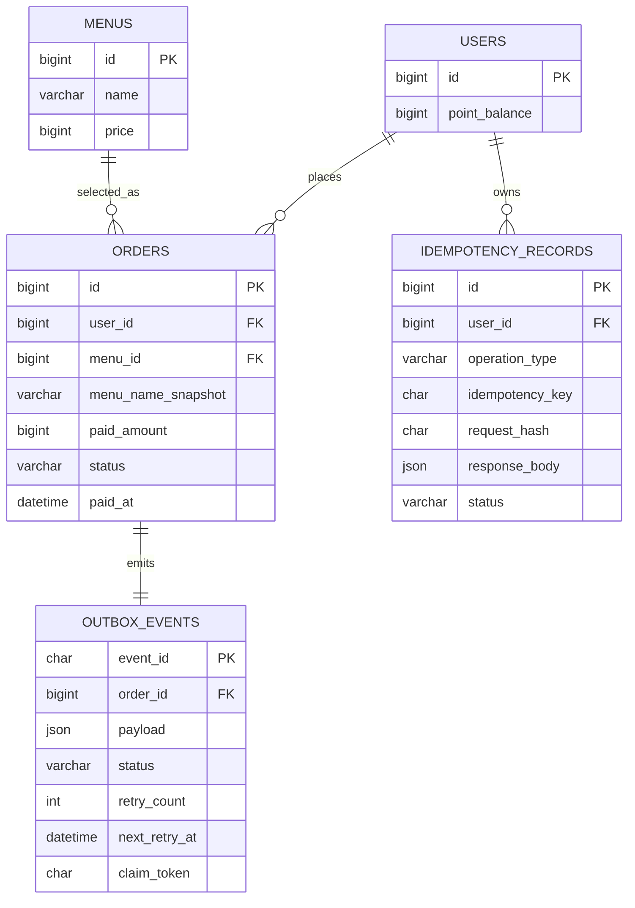

# Coffee Order System

다중 애플리케이션 인스턴스 환경에서도 포인트 잔액과 주문 데이터의 정합성을 지키는 커피 주문 REST API 백엔드입니다. 사용자는 포인트를 충전해 메뉴 하나를 주문하며, 시스템은 결제 완료 주문을 외부 데이터 수집 API로 준실시간 비동기 전달하고 최근 7일 인기 메뉴를 제공합니다.

> **문서와 구현 상태**
>
> 이 저장소의 문서는 목표 계약 초안을 설명합니다. ADR별 승인 여부는 [ADR 목록](./docs/adr/)에서 관리합니다. 현재 코드는 Spring Boot 애플리케이션 부트스트랩, 기본 컨텍스트 테스트, MySQL Docker Compose와 DB 연결 설정만 존재하며, 도메인 기능·DB 스키마·Flyway·외부 연동 워커는 아직 구현되지 않았습니다. 문서에 적힌 동작을 현재 구현 완료 상태로 해석하지 않습니다.

## 과제 요구사항 대응

원문 요구사항의 "사용자 식별값"은 충전·주문 요청 본문의 `userId`에 대응합니다. 사용자는 이미 존재한다고 가정하며 사용자 생성·인증은 현재 범위에 포함하지 않습니다. 과제·로컬 수동 검증에는 Flyway가 준비하는 기준 사용자 `userId=1`, 초기 잔액 `0P`를 사용하고, 존재하지 않는 `userId`는 `404 USER_NOT_FOUND`로 거절합니다.

| 필수 기능 | Method·Path | 핵심 입력 | 성공 결과·정합성 |
|---|---|---|---|
| 커피 메뉴 목록 | `GET /api/v1/menus` | 없음 | 메뉴 ID·현재 이름·현재 가격을 ID 오름차순 반환 |
| 포인트 충전 | `POST /api/v1/points/charge` | 기존 `userId`, UUID `Idempotency-Key`, 양의 정수 `amount` | 사용자 행 락 안에서 잔액 증가와 멱등 결과를 함께 커밋 |
| 커피 주문·결제 | `POST /api/v1/orders` | 기존 `userId`, UUID `Idempotency-Key`, `menuId` | 포인트 차감·주문 스냅샷·Outbox·멱등 결과를 함께 커밋 |
| 인기 메뉴 | `GET /api/v1/menus/popular` | 없음 | 직전 7×24시간 `PAID` 주문 수 상위 3개 반환 |

주문 데이터의 "실시간 전송" 요구는 정합성과 외부 장애 격리를 함께 지키는 준실시간 Transactional Outbox로 구체화한다. 주문 API는 외부 응답을 기다리지 않으며 주문과 이벤트를 같은 트랜잭션에 보존한 뒤, 워커 정상·전송 가능한 기존 backlog 없음 조건에서 주문 커밋 후 2초 이내에 최초 외부 HTTP 요청을 시작한다. 상세 필드·오류·재시도 계약은 [API 명세](./docs/api-spec.md)를 따른다.

### 핵심 ERD



`users.point_balance`는 signed `BIGINT`의 0 이상 값이며 임의의 업무 상한을 두지 않는다. 충전금액 자체의 타입 범위와 현재 잔액과의 덧셈 overflow는 애플리케이션에서 검사한다. 전체 컬럼·NULL·FK·CHECK·인덱스는 [ERD 정본](./docs/erd.md)을 따른다.

### 설계 의도와 문제 해결 전략

| 문제 | 분석한 대안 | 선택 | 선택 이유와 감수한 점 |
|---|---|---|---|
| 동시 충전·결제의 갱신 유실 | 애플리케이션 로컬 락, 낙관적 락, DB 비관적 락 | 사용자 행 `FOR UPDATE` | 공용 MySQL이 인스턴스 수와 무관한 사용자 단위 직렬화 경계가 됨. 같은 사용자 경합은 대기함 |
| 네트워크 재시도의 중복 변경 | 재시도 금지, 본문 추정, DB 유일 키, 멱등 결과 저장 | UUID 멱등키와 최초 결과 저장 | 충전·주문을 한 번만 반영하고 응답 유실 뒤에도 최초 결과를 재사용함. 멱등 레코드가 추가됨 |
| 주문과 외부 이벤트의 이중 쓰기 | 트랜잭션 안 동기 HTTP, 메모리 큐, Kafka, Transactional Outbox | MySQL Transactional Outbox | 주문과 이벤트를 원자적으로 보존하고 외부 장애를 고객 요청에서 분리함. 폴링·재시도 워커가 필요함 |
| 다중 워커의 중복 점유와 늦은 갱신 | 단일 워커, 분산 락, `SKIP LOCKED`와 fencing | `SKIP LOCKED`, 30초 lease, `claim_token` | 여러 인스턴스가 작업을 나누고 만료된 워커의 상태 덮어쓰기를 막음. 외부 전달은 at-least-once임 |
| 인기 메뉴 주문 수의 정확성 | 캐시·사전 집계, 이벤트 조회 모델, 주문 직접 집계 | 최근 `PAID` 주문 직접 집계 | 별도 집계 정합성 문제 없이 커밋된 주문과 즉시 일치함. 데이터 증가 시 쿼리 비용을 측정해야 함 |
| 사용자 식별 | 요청 본문 사용자 ID, 별도 인증 API, JWT | 요청 본문 `userId` | 과제 원문의 입력 계약에 직접 대응하고 인증 범위를 추가하지 않음. 사용자 ID 소유권은 검증하지 않음 |
| MySQL 고유 동작 검증 | H2, 저장소 mock, 실제 MySQL | 단일 Compose MySQL의 별도 테스트 DB | 실제 제품 동작을 검증하면서 개발 데이터와 전역 Outbox 워커의 간섭을 차단함. 테스트 DB 초기화가 추가됨 |

### 기술적 선택 이유

| 기술 | 선택 이유 |
|---|---|
| Java 17·Spring Boot 4.1 | 현재 빌드 기준선을 유지하고 Web MVC·JPA·Validation·Actuator 생태계를 일관되게 사용 |
| MySQL 8.4 LTS | 포인트·주문·멱등 결과·Outbox의 단일 진실 원천이자 행 락과 `SKIP LOCKED` 제공 |
| Flyway | 스키마·초기 메뉴·과제용 기준 사용자를 코드와 함께 버전 관리하고 빈 DB 재현성을 확보 |
| JDK `HttpClient`·Mock HTTP | 외부 전달과 테스트에 별도 HTTP 라이브러리를 추가하지 않고 표준 기능 사용 |
| Actuator·Micrometer | 기본 HTTP·HikariCP 지표와 최소한의 DB 경합·Outbox 사용자 정의 지표를 같은 방식으로 관찰 |
| Spotless | Java 포맷을 `check` 완료 게이트에서 결정적으로 검사하고 필요할 때만 명시적으로 자동 수정 |

## 제품 범위

- 기존 사용자 ID와 양의 정수 금액을 입력해 포인트를 충전합니다.
- 기존 사용자 ID와 메뉴 ID를 입력해 메뉴 하나를 포인트로 주문하고 결제합니다.
- 결제 완료 주문을 Transactional Outbox로 외부 데이터 수집 API에 전달하며 정상·backlog 없음 조건의 최초 요청은 커밋 후 2초 이내 시작합니다.
- 조회 시점 직전 7×24시간 동안의 결제 완료 주문을 집계해 인기 메뉴 상위 3개를 반환합니다.

상세 요구사항과 수용 기준은 [PRD](./docs/prd.md), 요청·응답 계약은 [API 명세](./docs/api-spec.md)를 기준으로 합니다.

## 핵심 처리 흐름

| 흐름 | 처리 요약 | 정합성 경계 |
|---|---|---|
| 포인트 충전 | 멱등 요청 확인 → 사용자 행 잠금 → 덧셈 overflow 검사 → 잔액 증가 → 최초 결과 저장 | 비즈니스 변경과 멱등 레코드를 하나의 MySQL 트랜잭션으로 커밋 |
| 주문 및 결제 | 멱등 요청 확인 → 현재 메뉴 조회 → 사용자 행 잠금 → 잔액 차감 → 주문 스냅샷과 Outbox 저장 | 포인트·주문·Outbox·멱등 결과를 하나의 MySQL 트랜잭션으로 커밋 |
| 주문 이벤트 전달 | 워커가 이벤트 선점 → DB 트랜잭션 밖에서 외부 호출 → 성공 또는 재시도 상태 저장 | `SKIP LOCKED`, `claim_token`, 30초 lease로 다중 워커의 갱신을 fencing |
| 인기 메뉴 조회 | `PAID` 주문의 최근 7×24시간 주문 수 집계 → 현재 메뉴 정보 결합 | 주문 수는 `orders`, 응답 이름·가격은 현재 `menus`가 기준 |

예상 가능한 비즈니스 실패는 해당 결과를 멱등 레코드에 저장하고 커밋합니다. 존재하지 않는 사용자는 멱등 레코드를 만들기 전에 거절합니다. DB 연결 실패, 5초 락 대기 timeout과 deadlock 같은 인프라 오류는 비즈니스 변경과 멱등 레코드를 모두 롤백하므로 같은 요청을 다시 시도할 수 있습니다. 자세한 상태 전이와 재사용 규칙은 [API 명세의 멱등성 계약](./docs/api-spec.md#8-멱등성-계약)을 따릅니다.

## 핵심 불변식

1. `users.point_balance`는 어떤 커밋 시점에도 음수가 될 수 없습니다.
2. 같은 사용자의 충전과 결제는 사용자 행 비관적 락으로 직렬화합니다.
3. 충전·주문의 `userId`는 존재하는 `users.id`여야 하며 사용자 생성과 소유권 검증은 범위 밖입니다.
4. 같은 사용자·작업 유형에서 하나의 `Idempotency-Key`는 하나의 요청 내용에만 대응합니다.
5. 주문 한 건은 메뉴 하나만 포함하며, 주문 시점의 메뉴명과 결제금액은 변경하지 않습니다.
6. 주문이 커밋되면 같은 트랜잭션에 대응하는 `ORDER_PAID` Outbox 이벤트가 정확히 하나 존재합니다.
7. 외부 이벤트 전달은 at-least-once입니다. 수신 측은 `eventId`로 중복 반영을 방지해야 합니다.
8. 인기 메뉴의 주문 수는 `PAID` 주문만 집계하고, 동률이면 메뉴 ID 오름차순으로 순위를 결정합니다.

데이터 구조와 제약 조건은 [ERD](./docs/erd.md), 모듈과 트랜잭션 흐름은 [아키텍처](./docs/architecture.md)에 상세히 설명합니다.

## 기술 기준선

| 영역 | 확정 기준 |
|---|---|
| Java | Amazon Corretto 17 호환 Java 17 |
| 애플리케이션 | Spring Boot 4.1.0, Spring Web MVC, Spring Data JPA |
| 입력 검증 | Spring Boot Validation |
| 빌드 | Gradle 9.5.1 Wrapper |
| 데이터베이스 | MySQL 8.4 LTS |
| 스키마 변경 | Flyway (`flyway-core`, `flyway-mysql`) |
| 테스트 | JUnit 5, 실제 MySQL 기반 통합 테스트, 외부 API Mock 서버 |
| 관측성 | Spring Boot Actuator, Micrometer |
| 코드 포맷 검사 | Gradle Spotless와 Java 포매터, `spotlessCheck`를 `check`에 포함 |
| 로컬 인프라 | Docker Compose로 MySQL만 실행; 애플리케이션은 호스트에서 Gradle로 실행 |

버전 선택의 근거는 [ADR-0005](./docs/adr/0005-establish-java-spring-mysql-platform-baseline.md), 애플리케이션 구성 방식은 [ADR-0006](./docs/adr/0006-use-feature-oriented-modular-monolith.md)를 참고합니다.

자동 구현 단계에서 추가가 승인된 애플리케이션 의존성은 `spring-boot-starter-validation`, `spring-boot-starter-actuator`, `org.flywaydb:flyway-core`, `org.flywaydb:flyway-mysql`뿐입니다. 빌드 도구로는 Spotless 플러그인과 Java 포매터가 추가 승인됐습니다. Mock HTTP, 비동기 HTTP와 bounded polling은 JDK 표준 기능을 사용하고 다른 라이브러리는 추가 전에 다시 확인합니다.

첫 구현의 관측성은 Spring MVC의 `http.server.requests`, HikariCP 기본 지표, DB lock timeout·deadlock 카운터, Outbox 전송 결과·재시도·최종 실패·fencing 거절 카운터, `PENDING`·`FAILED` 건수와 가장 오래된 대기 이벤트 시간 gauge로 제한합니다. 요청·사용자·주문·이벤트 ID는 key-value 로그로 연결합니다. HTTP에는 상세 정보를 숨긴 `/actuator/health`만 노출하고 외부 exporter, JSON 로그 라이브러리와 알림 규칙은 추가하지 않습니다.

## 로컬 실행 계약

다음 순서로 Docker Compose의 MySQL 8.4 LTS 인스턴스를 준비한 뒤 테스트하고 애플리케이션을 실행합니다.

```bash
cp .env.example .env
# .env의 비밀번호와 비밀값을 실행 환경에 맞게 변경
docker compose up -d --wait
./gradlew test
./gradlew check
./gradlew bootRun
```

- Docker Compose에는 MySQL 서비스만 포함합니다. 애플리케이션 컨테이너는 만들지 않습니다.
- 기본 개발 데이터베이스는 `coffee_order_system`, 테스트 데이터베이스는 `coffee_order_system_test`, 사용자명은 `coffee`입니다. DB 비밀번호에는 기본값이 없습니다.
- 자동 구현은 멱등적인 `docker/mysql/init/01-create-test-database.sh`를 MySQL 초기화 디렉터리에 연결해 신규 볼륨에서 테스트 데이터베이스와 애플리케이션 사용자 권한을 자동 준비해야 합니다.
- 기존 볼륨에 테스트 데이터베이스가 없다면 구현된 초기화 스크립트를 `docker compose exec mysql bash /docker-entrypoint-initdb.d/01-create-test-database.sh`로 한 번 실행합니다. 이 절차는 데이터베이스와 권한을 멱등적으로 준비하며 볼륨이나 개발 데이터를 삭제하지 않습니다.
- 기존 로컬 MySQL과의 충돌을 피하기 위해 기본 호스트 포트는 `3307`입니다.
- 개발 데이터베이스 이름과 JDBC URL은 `DB_NAME`, `DB_URL`, 테스트 데이터베이스 이름과 JDBC URL은 `TEST_DB_NAME`, `TEST_DB_URL`로 재정의할 수 있습니다. 호스트 포트는 `DB_PORT`, 사용자명은 `DB_USERNAME`, 비밀번호는 `DB_PASSWORD`, MySQL root 비밀번호는 `DB_ROOT_PASSWORD`로 재정의합니다.
- 외부 API 주소는 `COLLECTION_API_BASE_URL`로 주입하며 기본값이 없습니다. 누락되거나 잘못되면 애플리케이션 시작이 실패합니다.
- Outbox 워커 활성화 여부는 `OUTBOX_WORKER_ENABLED`, 폴링 주기와 배치 크기는 `OUTBOX_POLL_INTERVAL_MS`, `OUTBOX_BATCH_SIZE`로 설정하며 기본값은 각각 `true`, `1000`, `50`입니다.
- 로컬에서는 저장소 루트의 `.env`를 Docker Compose와 Spring Boot가 함께 읽습니다. `.env`와 `.env.*`는 커밋하지 않고 키 목록과 안전한 예시만 `.env.example`로 관리합니다.
- CI·운영에서는 `.env` 파일 대신 같은 이름의 시스템 환경 변수를 주입할 수 있으며, 시스템 환경 변수가 `.env` 값보다 우선합니다.
- Flyway 구현 후 애플리케이션 시작 시 스키마, 초기 메뉴와 과제·로컬용 기준 사용자 `id=1`, `point_balance=0`을 적용합니다.
- 통합 테스트는 인메모리 DB로 대체하지 않고 실제 MySQL과의 SQL·락·제약 조건 동작을 검증합니다.
- 개발과 테스트는 같은 Compose MySQL 인스턴스를 사용하되 서로 다른 데이터베이스를 사용합니다. 일반 테스트에서는 Outbox 워커를 비활성화하고 Outbox 전용 테스트에서만 활성화합니다.
- 테스트는 고유 데이터만 FK 순서로 정리합니다. 전체 `TRUNCATE`, schema 삭제와 `Flyway clean`은 사용하지 않습니다.
- 첫 자동 구현 완료 게이트에는 기능·동시성·외부 계약·품질 검사와 정상 조건의 Outbox 최초 요청 2초 검증을 포함합니다. `PT-*` 부하·성능 기준선은 기능 구현 후 별도 작업으로 측정합니다.

완료 판정 절차와 테스트 범위는 [테스트 전략](./docs/test-strategy.md)을 따릅니다.

## 문서 지도

| 문서 | 책임 |
|---|---|
| [도메인 컨텍스트](./docs/context.md) | 공통 용어, 데이터 출처, 컨텍스트·트랜잭션 경계 |
| [PRD](./docs/prd.md) | 기능별 목적, 선행 조건, 후조건, 수용 기준과 비기능 요구사항 |
| [API 명세](./docs/api-spec.md) | HTTP 요청·응답 필드, 오류 코드, 멱등성과 외부 연동 계약 |
| [ERD](./docs/erd.md) | 테이블 관계, 필드, 제약 조건과 데이터 불변식 |
| [아키텍처](./docs/architecture.md) | 모듈 구조, 동시성 제어, Outbox 처리 흐름과 장애 대응 |
| [테스트 전략](./docs/test-strategy.md) | 테스트 계층, 동시성·원자성·외부 연동 검증 방법 |
| [요구사항 추적표](./docs/requirements-traceability.md) | 요구사항과 설계·테스트 근거의 연결 |

### Architecture Decision Records

결정과 상태의 정본은 [ADR 목록](./docs/adr/)에서 관리합니다. 대체된 결정은 구현 계약으로 사용하지 않으며, 새 구조 결정을 추가하거나 기존 결정을 뒤집을 때는 새 ADR로 이력을 남깁니다.

## 의도적으로 제외한 범위

- 프론트엔드와 관리자 화면
- 메뉴 등록·수정·삭제 API
- 다품목 주문, 수량, 장바구니
- 주문 취소·환불
- 포인트 원장
- 사용자 생성·수정·삭제, 회원가입·로그인과 인증·인가
- Redis·Kafka 기반 잠금 또는 인기 메뉴 사전 집계
- 실제 클라우드 배포와 Kubernetes·Terraform

제외 범위가 제품 요구사항으로 바뀌면 기존 데이터 모델이나 정합성 경계를 바로 수정하지 않고, 영향과 대안을 먼저 ADR로 검토합니다.
