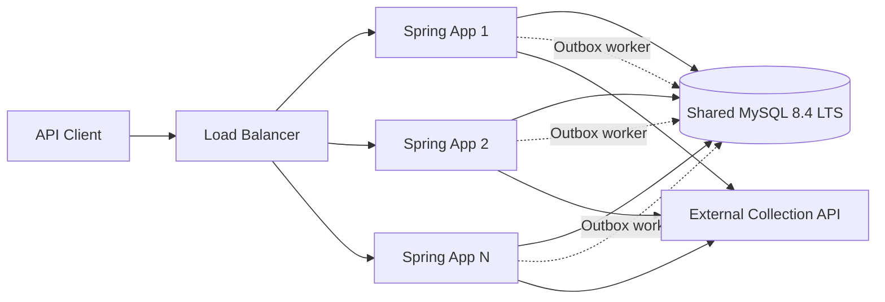
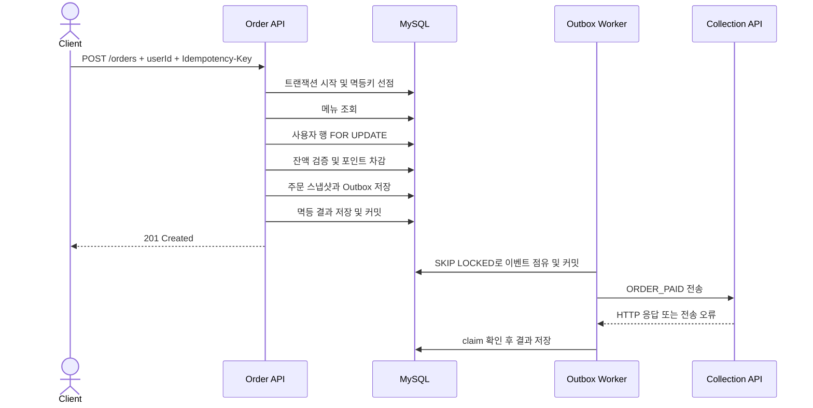

# Architecture

## 1. 문서 상태와 범위

이 문서는 사용자가 선택한 커피 주문 시스템의 **목표 아키텍처 초안**을 설명한다. ADR별 승인 여부는 [ADR 목록](./adr/)에서 관리하며, 저장소에는 Spring Boot 애플리케이션 부트스트랩, 기본 컨텍스트 테스트, MySQL Docker Compose와 DB 연결 설정이 있다. 아래 업무 모듈·테이블·트랜잭션·워커는 아직 구현 완료 상태가 아니다. 구현이 진행되면 코드, Flyway 마이그레이션, [ERD](./erd.md), [API 명세](./api-spec.md)가 이 문서와 일치하는지 함께 검증한다.

범위는 하나의 배포 단위로 실행되는 REST API 백엔드, 공용 MySQL, 그리고 애플리케이션 내부 Outbox 워커까지다. 실제 클라우드 배포, 로드 밸런서 제품 선택, MySQL 고가용성 구성, 외부 수집 시스템 구현은 범위 밖이다.

## 2. 승인된 기술 기준선

| 구분 | 기준 | 용도 |
|---|---|---|
| 런타임 | Amazon Corretto 17 | 애플리케이션 JVM |
| 프레임워크 | Spring Boot 4.1.0 | REST API, 보안, 트랜잭션, 데이터 접근 |
| 빌드 | Gradle 9.5.1 | 빌드와 테스트 실행 |
| 데이터베이스 | MySQL 8.4 LTS | 업무 데이터와 동시성 제어의 단일 진실 원천 |
| 스키마 관리 | Flyway (`org.flywaydb:flyway-core`, `org.flywaydb:flyway-mysql`) | 스키마와 초기 메뉴 데이터의 버전 관리 |
| 입력 검증 | Spring Boot Validation | Bean Validation 기반 요청 필드 검증 |
| 관측성 | Spring Boot Actuator, Micrometer | health와 애플리케이션 지표 수집 |
| 코드 포맷 검사 | Gradle Spotless와 Java 포매터 | `check`의 결정적 포맷 완료 게이트 |
| 로컬 인프라 | Docker Compose | MySQL만 실행 |
| 테스트 | JUnit 5, 실제 MySQL, Mock HTTP 서버 | 단위·통합·외부 연동 검증 |

로컬에서는 Docker Compose로 MySQL만 실행하고 애플리케이션은 호스트에서 실행한다.

```bash
docker compose up -d --wait
./gradlew test
./gradlew bootRun
```

`bootRun` 전에 기본값이 없는 `COLLECTION_API_BASE_URL`을 실행 환경에 설정해야 한다.

Compose는 MySQL `8.4` 이미지 태그를 사용한다. JDBC 연결 풀 설정과 Flyway 파일 구성은 구현 시 정하되 위 기준선을 변경하지 않는다.

현재 구현 단계에서 추가가 승인된 애플리케이션 의존성은 `spring-boot-starter-validation`, `spring-boot-starter-actuator`, `org.flywaydb:flyway-core`, `org.flywaydb:flyway-mysql`이다. 빌드 도구로는 Spotless 플러그인과 Java 포매터가 승인됐다. 외부 Mock API, 비동기 HTTP와 동시성 테스트는 JDK 표준 기능으로 구현하며 그 밖의 라이브러리는 추가 전에 다시 확인한다.

통합 테스트는 같은 Compose MySQL 인스턴스의 `coffee_order_system_test`를 사용해 개발 데이터베이스와 분리한다. 일반 테스트에서는 Outbox 워커를 비활성화하고 Outbox 전용 테스트에서만 Mock HTTP 서버와 함께 활성화한다. 다중 인스턴스 테스트는 서로 다른 랜덤 포트의 독립 Spring Context 두 개가 같은 테스트 DB를 사용한다.

## 3. 결정 근거

| 주제 | 결정 기록 |
|---|---|
| 포인트 동시성 | [ADR-0001: 포인트 변경에 DB 비관적 락 사용](./adr/0001-use-database-pessimistic-locking-for-points.md) |
| 변경 API 멱등성 | [ADR-0015: 충전과 주문에 멱등키 적용](./adr/0015-protect-mutations-with-idempotency-keys.md) |
| 외부 이벤트 전달 | [ADR-0003: 주문 이벤트를 Transactional Outbox로 전달](./adr/0003-deliver-order-events-with-transactional-outbox.md) |
| 인기 메뉴 집계 | [ADR-0004: 인기 메뉴를 결제 완료 주문에서 직접 집계](./adr/0004-calculate-popular-menus-from-paid-orders.md) |
| 기술 기준선 | [ADR-0005: Java·Spring·MySQL 플랫폼 기준선](./adr/0005-establish-java-spring-mysql-platform-baseline.md) |
| 애플리케이션 구조 | [ADR-0006: 기능 중심 모듈러 모놀리스](./adr/0006-use-feature-oriented-modular-monolith.md) |
| 포인트 모델 | [ADR-0016: 임의 상한 없이 현재 포인트 잔액 저장](./adr/0016-store-positive-point-balance-without-arbitrary-cap.md) |
| 사용자 식별 | [ADR-0022: 인증 없이 요청 본문의 사용자 ID 사용](./adr/0022-accept-user-id-without-authentication.md) |
| 주문 모델 | [ADR-0009: 단일 메뉴 주문과 주문 시점 스냅샷](./adr/0009-model-single-menu-orders-with-snapshots.md) |
| 통합 테스트 환경 | [ADR-0010: Docker Compose의 MySQL로 테스트](./adr/0010-test-against-mysql-with-docker-compose.md) |
| DB 경합 오류 | [ADR-0011: DB 경합 timeout과 deadlock에 일시적 오류 반환](./adr/0011-return-temporary-unavailable-on-database-contention.md) |
| 관측성 구현 | [ADR-0013: 관측성에 Actuator와 Micrometer 사용](./adr/0013-use-actuator-and-micrometer-for-observability.md) |
| Outbox 배치 실행 | [ADR-0014: Outbox 배치를 비동기로 병렬 전송](./adr/0014-send-outbox-batches-asynchronously.md) |
| Outbox 최초 시도 시간 | [ADR-0017: Outbox 최초 전송 시도 시간을 제한](./adr/0017-bound-first-outbox-attempt-latency.md) |
| 테스트 격리 | [ADR-0018: 테스트 데이터베이스와 Outbox 워커 격리](./adr/0018-isolate-test-database-and-outbox-workers.md) |
| 코드 포맷 완료 게이트 | [ADR-0019: Spotless를 코드 포맷 완료 게이트로 사용](./adr/0019-use-spotless-as-format-gate.md) |
| DB 상태 불변식 | [ADR-0020: 상태 수명주기 불변식을 DB CHECK로 강제](./adr/0020-enforce-lifecycle-invariants-with-database-checks.md) |

이 문서는 위 결정을 상세화한다. 결정을 뒤집거나 새로운 구조 결정을 추가해야 하면 먼저 사용자 확인을 받고 ADR로 남긴다.

## 4. 설계 원칙

- 애플리케이션 인스턴스는 서버 로컬 세션과 로컬 락에 의존하지 않는다.
- MySQL을 사용자, 포인트, 주문, 멱등 결과, 외부 전송 상태의 단일 진실 원천으로 사용한다.
- 충전과 결제는 사용자 행 비관적 락으로 직렬화한다.
- 고객 요청 트랜잭션에는 외부 HTTP 호출을 포함하지 않는다.
- 주문과 외부 전송 이벤트 사이의 원자성은 Transactional Outbox로 보장한다.
- 포인트는 현재 잔액만 저장하며, 이번 범위에 포인트 원장이나 감사 이력을 추가하지 않는다.
- 한 주문에는 메뉴 하나만 포함하고, 주문 당시 메뉴명과 결제금액을 주문에 보존한다.
- 정상·backlog 없음 조건의 Outbox 최초 요청 2초 기준 외에는 정량 성능 목표를 임의로 정하지 않는다. 먼저 실제 부하 조건과 지표를 측정한 뒤 합의한다.

## 5. 런타임 구조



각 애플리케이션 인스턴스는 API와 Outbox 워커를 함께 실행할 수 있다. 여러 워커가 같은 이벤트를 조회하더라도 MySQL의 `FOR UPDATE SKIP LOCKED`와 `claim_token` fencing으로 점유를 조정한다. 외부 전송은 at-least-once이므로 동일 `eventId`가 재전송될 수 있으며, 수신 측은 `eventId`로 중복 반영을 막아야 한다.

그림의 로드 밸런서와 다중 인스턴스는 운영 확장 목표다. 로컬 기본 구성은 MySQL 컨테이너 하나와 호스트에서 실행하는 애플리케이션 하나다.

## 6. 모듈러 모놀리스

배포 단위와 데이터베이스는 하나로 유지하되, 코드는 기능을 먼저 나누고 기능 내부에서 책임을 분리한다. 아래는 목표 구조를 설명하는 개념 예시이며 정확한 클래스명과 패키지 세부 단계는 구현 시 코드와 함께 확정한다.

```text
com.example.coffeeordersystem
├── menu
├── point
├── order
├── idempotency
└── outbox
```

| 기능 | 책임 | 주 데이터 | 트랜잭션 역할 |
|---|---|---|---|
| Menu | 고정 메뉴 목록, 인기 메뉴 응답 조합 | `menus`, 집계된 `orders` | 읽기 |
| Point | 요청한 기존 사용자의 현재 잔액 충전 | `users.point_balance` | 사용자 행 잠금 후 증가 |
| Order | 메뉴 하나 결제, 주문 스냅샷 생성 | `users`, `menus`, `orders` | 사용자 행 잠금 후 차감·주문 저장 |
| Idempotency | 요청 키 선점, 요청 동일성 비교, 최초 결과 재사용 | `idempotency_records` | 충전·주문과 같은 트랜잭션에 참여 |
| Outbox | 이벤트 점유, 외부 전송, 재시도, 실패 보존 | `outbox_events` | 주문 저장 트랜잭션과 워커의 짧은 트랜잭션에 참여 |

기능 경계는 마이크로서비스 경계가 아니다. 별도 프로세스, 별도 데이터베이스, 메시지 브로커를 도입하지 않는다. 공통 코드는 실제로 둘 이상의 기능에서 안정적으로 재사용될 때만 최소화해서 둔다.

## 7. 요청별 데이터·트랜잭션 경계

| 흐름 | 주요 읽기/쓰기 | 트랜잭션 경계 | 외부 호출 |
|---|---|---|---|
| 메뉴 목록 | `menus` 조회 | 읽기 경계 | 없음 |
| 포인트 충전 | 멱등 레코드, 사용자 행 잠금, 잔액 증가, 결과 저장 | **모두 한 트랜잭션** | 없음 |
| 주문 및 결제 | 멱등 레코드, 메뉴 조회, 사용자 행 잠금, 잔액 차감, 주문·Outbox·결과 저장 | **모두 한 트랜잭션** | 없음 |
| 인기 메뉴 | 결제 완료 주문 집계, 현재 메뉴 정보 조합 | 읽기 경계 | 없음 |
| Outbox 점유 | 전송 가능 이벤트 잠금, `PROCESSING` 전환과 claim 기록 | 짧은 점유 트랜잭션 | 없음 |
| Outbox 전송 | 점유한 payload 읽기 | DB 트랜잭션 밖 | 외부 수집 API |
| Outbox 결과 반영 | claim 검증, 발행·재시도·실패 상태 저장 | 짧은 결과 트랜잭션 | 없음 |

충전과 주문에서 멱등 레코드만 별도 트랜잭션으로 먼저 확정하지 않는다. 업무 변경과 멱등 결과가 서로 다른 시점에 커밋되는 실패 구간을 만들지 않기 위해 하나의 DB 트랜잭션으로 처리한다.

상태·타입·금액·횟수와 멱등·Outbox의 핵심 상태별 NULL 조합은 애플리케이션 검증뿐 아니라 MySQL CHECK로도 강제한다. 상세 식은 [ERD의 목표 제약 조건](./erd.md#5-목표-제약-조건)을 따르며 상태 전이 서비스는 DB 오류를 정상 제어 흐름으로 사용하지 않는다.

## 8. 사용자 식별 경계

- 포인트 충전과 주문은 요청 본문의 `userId`를 사용한다.
- `userId`는 signed `BIGINT` 범위의 양의 정수이며 기존 `users.id`와 일치해야 한다.
- 사용자가 없으면 멱등 레코드를 만들기 전에 `404 USER_NOT_FOUND`로 거절한다.
- 사용자 생성·관리와 호출자가 지정한 사용자 ID의 소유권 검증은 이번 범위에 포함하지 않는다.
- 여러 애플리케이션 인스턴스는 같은 MySQL의 사용자 행을 기준으로 동일하게 처리한다.

## 9. 멱등 처리

### 9.1 식별과 결과 재사용

충전과 주문은 `(user_id, operation_type, idempotency_key)`를 논리 식별자로 사용한다. 같은 식별자의 동시 삽입은 DB UNIQUE 제약이 하나만 허용한다.

1. `userId`, 헤더 존재 여부, 기본 요청 형식을 검증하고 사용자가 존재하지 않으면 거절한다.
2. DB 트랜잭션을 시작하고 `INSERT ... ON DUPLICATE KEY UPDATE id = id`로 멱등키를 선점한 뒤 해당 레코드를 잠금 조회한다.
3. 이미 완료된 키면 저장된 `request_hash`와 현재 요청을 비교한다.
4. 해시가 같고 상태가 `COMPLETED`면 저장된 HTTP 상태와 응답 본문을 그대로 재사용한다.
5. 해시가 다르면 업무 변경 없이 `409 IDEMPOTENCY_KEY_REUSED`를 반환한다.
6. 최초 요청이면 같은 트랜잭션에서 충전 또는 주문을 처리한다.
7. 성공 또는 예상 가능한 비즈니스 실패 결과를 멱등 레코드에 `COMPLETED`로 저장하고 커밋한다.
8. DB 연결 실패처럼 예상하지 못한 인프라 오류는 멱등 레코드를 포함해 전체 롤백한다.

> API 오류 코드의 정식 표기는 [API 명세](./api-spec.md)를 따른다. 위 5번의 응답 코드는 `IDEMPOTENCY_KEY_REUSED`다.

예상 가능한 비즈니스 실패에는 잔액 부족, 메뉴 부재와 포인트 덧셈 overflow가 포함된다. 사용자 부재, 멱등키 누락·형식 오류, JSON 오류, 필수 필드 누락과 잘못된 충전 금액은 멱등 결과로 저장하지 않는다.

### 9.2 요청 동일성

`Idempotency-Key`는 UUID 문자열이며 파싱한 UUID의 표준 소문자 문자열을 저장한다. `request_hash`는 `CHARGE|<amount>` 또는 `ORDER|<menuId>`의 UTF-8 바이트를 SHA-256으로 계산한 64자 16진수다. JSON 원문·공백·필드 순서는 해시 입력에 포함하지 않는다.

### 9.3 잠금 순서와 보존

충전과 주문은 멱등 레코드 잠금 후 사용자 행을 잠그는 일관된 순서를 사용한다. 모든 DB 커넥션에는 `SET SESSION innodb_lock_wait_timeout=5`를 적용한다. 트랜잭션 안에서 외부 HTTP 호출이나 불필요한 계산을 하지 않아 동일 사용자의 락 대기 시간을 줄인다.

`COMPLETED` 멱등 레코드는 `completed_at`부터 최소 24시간 보존하고 이후 삭제할 수 있다. 자동 정리 스케줄러와 정확한 삭제 시각은 현재 범위에 없으며 실제로 삭제된 키만 새 요청으로 처리될 수 있다.

사용자 행 또는 멱등키의 DB 락 대기는 최대 5초다. timeout이나 deadlock이면 전체를 롤백하고 멱등 결과를 저장하지 않은 채 `503 TEMPORARILY_UNAVAILABLE`을 반환한다.

## 10. 포인트 충전

포인트는 `users.point_balance`의 현재 값만 저장한다. 충전·사용 내역을 별도 원장으로 재구성할 수 없다는 제약을 받아들이며, 감사·환불·정산 요구가 생기면 원장 도입을 새로운 결정으로 검토한다.

`userId`·헤더·JSON과 signed `BIGINT` 범위의 양의 정수 충전금액을 검증하고 사용자가 없으면 멱등 처리 전에 거절한다. 충전 트랜잭션은 다음 순서로 처리한다.

1. 멱등 레코드를 선점하거나 완료 결과를 재사용한다.
2. 요청한 사용자 행을 PK로 `FOR UPDATE` 조회한다.
3. 현재 잔액과 충전금액의 signed `BIGINT` 덧셈 overflow를 검사한 뒤 금액을 더한다.
4. 최종 잔액과 최초 응답을 멱등 레코드에 저장한다.
5. 잔액 변경과 멱등 결과를 함께 커밋한다.

DB의 `point_balance >= 0` CHECK는 애플리케이션 검증을 보조한다. 신규 사용자는 0P로 시작하며 임의의 1회 충전 상한이나 잔액 상한은 두지 않는다. 유효한 충전금액을 더할 때 signed `BIGINT` overflow가 발생하면 `409 POINT_BALANCE_OVERFLOW`를 멱등 결과로 저장한다.

## 11. 주문 트랜잭션



주문 트랜잭션의 상세 순서는 다음과 같다.

1. 멱등 레코드를 선점하거나 완료 결과를 재사용한다.
2. `menus`에서 요청한 메뉴의 현재 이름과 가격을 읽는다.
3. 요청한 사용자 행을 PK로 `FOR UPDATE` 조회한다.
4. 잔액이 현재 메뉴 가격 이상인지 검증한다.
5. 잔액에서 가격을 차감한다.
6. 메뉴 ID, 주문 시점 메뉴명, 결제금액을 가진 `PAID` 주문을 저장한다.
7. 같은 트랜잭션에서 주문당 하나의 `ORDER_PAID` Outbox 이벤트를 저장한다.
8. `201 Created` 응답을 멱등 결과로 저장한다.
9. 포인트, 주문, Outbox, 멱등 결과를 한 번에 커밋한다.

메뉴 부재 또는 잔액 부족은 예상 가능한 결과로 멱등 레코드만 `COMPLETED` 상태로 커밋하고, 포인트·주문·Outbox는 변경하지 않는다. DB 오류, 5초 락 timeout, deadlock이나 Outbox 삽입 실패는 전체 트랜잭션을 롤백한다. 외부 API 호출은 커밋 이후 별도 워커가 수행한다.

현재 주문은 메뉴 하나와 수량 1만 표현한다. 메뉴명과 결제금액 스냅샷은 주문 이력용이며, 인기 메뉴 응답의 이름과 가격은 현재 `menus`에서 가져온다.

## 12. Outbox 전달

### 12.1 점유와 fencing

각 워커는 전송 가능한 이벤트를 짧은 DB 트랜잭션에서 다음과 같이 점유한다.

1. 즉시 또는 재시도 시각이 지난 `PENDING` 이벤트와 30초 lease가 만료된 `PROCESSING` 이벤트를 후보로 조회한다.
2. 후보 행은 `FOR UPDATE SKIP LOCKED`로 잠가 다른 워커가 기다리지 않고 다음 행을 찾게 한다.
3. 선택한 행을 `PROCESSING`으로 바꾸고 새 `claim_token`과 `locked_at`을 기록한다.
4. 점유 트랜잭션을 커밋한 다음 DB 트랜잭션 밖에서 외부 HTTP를 호출한다.
5. 결과 반영은 `event_id`, `PROCESSING`, `claim_token`이 모두 일치할 때만 수행한다.

lease 만료 후 다른 워커가 새 토큰으로 재점유하면 이전 워커의 늦은 결과 갱신은 0건으로 끝난다. 이 fencing은 오래된 워커가 최신 상태를 덮어쓰는 것을 막지만, 이미 시작된 외부 HTTP 요청 자체를 취소하지는 못한다. 따라서 전달 보장은 정확히 한 번이 아니라 at-least-once다.

`claim_token`은 UUID 문자열이다. 워커는 활성 배치가 없을 때 `next_retry_at`, `created_at`, `event_id` 오름차순으로 최대 50건을 선점하고 JDK `HttpClient.sendAsync`로 병렬 전송한다. 인스턴스마다 활성 배치는 하나만 허용하며 로컬 활성 배치 표시는 실행 과부하만 제어한다. 이벤트 소유권과 정합성은 계속 DB lease와 fencing이 담당한다. 폴링 주기는 `OUTBOX_POLL_INTERVAL_MS`로 기본 1초, 배치 크기는 `OUTBOX_BATCH_SIZE`로 기본 50건이며 환경 설정으로 바꿀 수 있다.

주문 커밋과 동시에 이벤트를 전송 가능 상태로 두고, 워커 정상·전송 가능한 기존 backlog 없음 조건에서 2초 이내에 최초 외부 HTTP 요청을 시작한다. 이 기준은 외부 응답 완료나 `PUBLISHED` 전환 시간이 아니며 주문 API는 외부 응답을 기다리지 않는다.

### 12.2 재시도 일정

`retry_count`는 완료된 실패 시도 횟수를 뜻한다. 총 전송 시도는 최대 4회다.

| 시도 | 시도 시점 | 재시도 가능한 실패 뒤 처리 |
|---:|---|---|
| 1 | 주문 커밋과 동시에 전송 가능, 정상·backlog 없음 조건에서 2초 이내 요청 시작 | `retry_count=1`, 1분 뒤 예약 |
| 2 | 첫 실패 1분 뒤 | `retry_count=2`, 5분 뒤 예약 |
| 3 | 둘째 실패 5분 뒤 | `retry_count=3`, 30분 뒤 예약 |
| 4 | 셋째 실패 30분 뒤 | `retry_count=4`, `FAILED` 전환 |

예약 시각은 각 실패 결과를 기록하는 시각을 기준으로 계산한다. 워커 지연이나 장애가 있으면 실제 전송은 예약 시각보다 늦을 수 있다.

### 12.3 HTTP 결과 분류

| 결과 | 상태 전이 | 이유 |
|---|---|---|
| HTTP `2xx` | `PUBLISHED` | 수신 성공 |
| 네트워크 오류, 연결 실패, timeout | 다음 재시도 또는 4회째 `FAILED` | 일시 장애 가능 |
| HTTP `408`, `429`, `5xx` | 다음 재시도 또는 4회째 `FAILED` | 일시 장애·과부하 가능 |
| 그 밖의 HTTP `4xx` | 즉시 `FAILED` | 같은 요청을 반복해도 성공 가능성이 낮음 |
| HTTP `3xx` | 즉시 `FAILED` | redirect를 따르지 않음 |

JDK HTTP 클라이언트의 연결 timeout은 2초, 요청 전체 timeout은 5초, 이벤트 lease는 30초다. redirect는 비활성화한다.

외부 API의 base URL은 기본값 없는 `COLLECTION_API_BASE_URL` 환경 변수로 주입한다. 누락되거나 잘못되면 애플리케이션 시작이 실패한다. 현재 범위에서는 별도 자격 증명 헤더를 사용하지 않고 `POST /events/orders`의 응답 본문도 성공 판정이나 저장에 사용하지 않는다.

### 12.4 상태 보존

- `PUBLISHED` 이벤트는 발행 완료 후 최소 30일간 보존하고 이후 삭제할 수 있다.
- `FAILED` 이벤트에는 `failed_at`, 선택적인 `last_http_status`, `last_error_type`을 저장하고 자동 삭제하지 않는다.
- 응답 본문과 stack trace는 DB에 저장하지 않는다.
- 자동 정리 스케줄러와 수동 재처리 API·운영 화면은 현재 범위가 아니다.

## 13. 인기 메뉴 조회

기준 시각 `to` 직전 7×24시간인 `[to - 7일, to)` 구간에서 `PAID` 주문을 직접 집계한다. 주문 수 내림차순, 동률이면 메뉴 ID 오름차순으로 정렬하고 최대 3개를 반환한다.

```sql
SELECT
    m.id AS menu_id,
    m.name,
    m.price,
    COUNT(*) AS order_count
FROM orders o
JOIN menus m ON m.id = o.menu_id
WHERE o.status = 'PAID'
  AND o.paid_at >= :from
  AND o.paid_at < :to
GROUP BY m.id, m.name, m.price
ORDER BY order_count DESC, m.id ASC
LIMIT 3;
```

주문 횟수는 변경되지 않는 주문 원본에서 계산하고, 응답의 이름과 가격은 현재 `menus` 값을 사용한다. 주문 당시 이름과 결제금액 스냅샷은 인기 메뉴 응답에 사용하지 않는다. 시간은 UTC로 계산하며 테스트에서는 주입 가능한 `Clock`으로 경계를 고정한다.

기본 인덱스는 `orders(status, paid_at, menu_id)`다. 별도 캐시나 이벤트 기반 집계는 실제 병목이 확인되고 집계 지연 허용 기준이 생기기 전에는 추가하지 않는다.

## 14. 인덱스와 핵심 경로

세부 컬럼과 제약은 [ERD](./erd.md)를 따른다.

| 핵심 경로 | 접근 방식 | 지원 인덱스 | 확인할 항목 |
|---|---|---|---|
| 충전·결제 | 사용자 PK `FOR UPDATE` | `users(id)` PK | 락 대기, deadlock, 트랜잭션 시간 |
| 멱등 결과 | 사용자·작업·키 단건 조회/삽입 | UNIQUE `(user_id, operation_type, idempotency_key)` | 중복키 대기, 재사용률, 충돌률 |
| 인기 메뉴 | 상태·시간 구간 집계 | `orders(status, paid_at, menu_id)` | 스캔 행 수, 임시 테이블, 정렬, 응답 분포 |
| 전송 예정 점유 | 상태·재시도 시각 조회 | `outbox_events(status, next_retry_at)` | 조회 행 수, backlog, 예약 지연 |
| lease 만료 복구 | 상태·잠금 시각 조회 | 후보: `outbox_events(status, locked_at)` | 만료 건수, 중복 점유, claim 불일치 |
| 주문당 이벤트 보장 | 주문 ID 중복 방지 | `outbox_events(order_id)` UNIQUE | 중복 삽입 실패 |

운영과 유사한 데이터 분포에서 `EXPLAIN ANALYZE`로 인기 메뉴와 Outbox 후보 조회의 실제 실행 계획을 확인한다. 작은 개발 데이터에서 인덱스가 선택되지 않았다는 이유만으로 결론 내리지 않고, 예상 기간 주문 수와 Outbox backlog를 재현한 뒤 스캔 행 수와 실행 시간을 기록한다.

`(status, locked_at)`은 lease 만료 조회가 실제 병목일 때 검토할 **미확정 인덱스 후보**다. 물리 스키마에 추가하기 전 실행 계획과 데이터 분포를 보고하고 사용자 확인 및 ADR 필요 여부 판단을 거친다.

## 15. 성능·확장성 검증

정상·backlog 없음 조건의 Outbox 최초 HTTP 요청 시작은 주문 커밋 후 2초 이내로 확정했다. 그 밖의 정량 SLO나 기준 부하는 없으므로 임의의 응답 시간이나 RPS를 목표로 선언하지 않고 다음 항목을 측정 가능하게 만든다.

| 영역 | 지표 | 함께 기록할 조건 |
|---|---|---|
| API | 요청 수, 성공·오류율, p50/p95/p99 응답 시간 | 엔드포인트, 상태 코드, 인스턴스 수 |
| 처리량 | 초당 충전·주문·인기 조회 수 | 동시 사용자 수, 동일 사용자 경합 비율 |
| DB | 쿼리 시간, 활성 커넥션, 풀 대기, deadlock | 데이터 건수, 인덱스, 트랜잭션 종류 |
| 사용자 락 | `FOR UPDATE` 대기 시간과 timeout | 동일 사용자 동시 요청 수 |
| 인기 메뉴 | 집계 시간, 스캔 행 수, 실행 계획 | 7일 주문 수, 메뉴 수, 데이터 편향 |
| Outbox | 상태별 건수, oldest pending age, 발행 지연 | 워커 수, 배치 크기, 외부 API 상태 |
| 재시도 | 시도별 성공률, `FAILED` 전환 수 | 네트워크·HTTP 실패 유형 |
| fencing | lease 만료 재점유 수, claim 불일치 갱신 수 | HTTP 지연, 워커 중단 여부 |

부하 시나리오는 최소한 서로 다른 사용자 요청과 같은 사용자 경합 요청을 분리한다. JDBC 풀 크기, 워커 수, 점유 배치 크기, 폴링 주기는 DB 커넥션 한도와 위 측정 결과를 함께 보고 조정한다. 목표 p95/p99, 처리량, 허용 backlog와 알림 임계값은 예상 사용자 수·RPS·데이터 규모를 합의한 뒤 문서에 추가한다.

`PT-*` 부하·성능 기준선은 기능 구현 완료 후 별도 작업으로 실행한다. 첫 자동 구현 완료 게이트에는 기능·동시성·외부 계약·품질 검사와 정상 조건의 Outbox 최초 요청 2초 검증까지만 포함한다.

## 16. 장애 처리

| 장애 | 고객 요청 처리 | 데이터 상태 | 후속 관찰 |
|---|---|---|---|
| 잔액 부족 | `409` 반환 | 포인트·주문·Outbox 불변, 실패 멱등 결과 보존 | 비즈니스 오류율 |
| 메뉴 부재 | `404` 반환 | 포인트·주문·Outbox 불변, 실패 멱등 결과 보존 | 잘못된 메뉴 요청 수 |
| 같은 멱등키·같은 요청 | 최초 결과 반환 | 추가 변경 없음 | 멱등 재사용률 |
| 같은 멱등키·다른 요청 | `409` 반환 | 추가 변경 없음 | 키 충돌률과 요청 ID |
| DB 오류 또는 Outbox 저장 실패 | 서버 오류 | 멱등 레코드 포함 전체 롤백 | DB 오류, deadlock, 롤백 수 |
| 외부 API timeout·재시도 가능 오류 | 주문 성공 유지 | Outbox 재시도 예약 | 발행 지연, retry 수 |
| 외부 API 비재시도 `4xx` | 주문 성공 유지 | Outbox `FAILED` | 즉시 운영 확인 |
| 워커 중단 | 고객 요청 영향 없음 | 30초 lease 뒤 재점유 가능 | expired lease 수 |
| 이전 워커의 늦은 결과 | 고객 요청 영향 없음 | claim 불일치로 갱신 거부 | fencing 거부 수 |
| DB 락 5초 timeout·deadlock | `503` 반환 | 현재 트랜잭션과 멱등 레코드 롤백 | lock timeout·deadlock 수 |
| 애플리케이션 인스턴스 장애 | 다른 인스턴스가 처리 가능 | 공용 DB의 커밋 데이터 유지 | 인스턴스 health |

MySQL 자체 장애 시 쓰기 API는 성공으로 가장하지 않는다. MySQL 백업·복구·복제와 재해 복구 목표는 현재 범위 밖이며 운영 전 별도 결정이 필요하다.

## 17. 관측성과 보안 운영

- 요청 ID, 주문 ID, 이벤트 ID를 구조화 로그의 연관 키로 사용한다.
- 멱등키 전체 값과 DB 자격 증명은 로그에 남기지 않는다.
- 외부 호출 로그에는 대상, 시도 번호, 지연, 결과 분류, 이벤트 ID를 남기되 payload의 민감 정보는 최소화한다.
- Actuator와 Micrometer로 API 지연·오류, DB 풀, DB 경합 오류와 Outbox 상태·재시도를 측정한다.
- HTTP에는 상세 정보를 숨긴 Actuator health endpoint만 노출한다. 지표 endpoint, 외부 exporter와 알림 연동은 배포 환경 확정 후 정한다.
- `FAILED` 이벤트, 오래된 `PENDING`, deadlock, 락 timeout, DB 풀 고갈은 알림 후보이며 수치 임계값은 성능 기준과 함께 합의한다.
- 외부 API 주소는 `COLLECTION_API_BASE_URL`로 주입하며 기본값을 두지 않는다. DB 자격 증명과 함께 저장소에 커밋하지 않는다.
- 로컬 실행은 저장소 루트의 추적하지 않는 `.env`를 사용하고, 필요한 키와 안전한 예시는 `.env.example`로 공유한다. CI·운영은 같은 키의 시스템 환경 변수를 주입하며 이 값이 `.env`보다 우선한다.

## 18. 구현 후 측정할 운영 기준

제품·데이터·보안 계약은 확정했다. 다음 값은 실제 구현과 기준 부하 측정 뒤 조정한다.

- JDBC 풀 크기와 인스턴스당 Outbox 동시 요청 수
- 인기 메뉴·Outbox 쿼리의 추가 인덱스
- Outbox 최초 요청 2초 기준을 제외한 정량 성능 목표와 알림 임계값
- 보존 기간이 지난 데이터의 운영 정리 절차와 배치 크기

되돌리기 비싼 구조·데이터 모델·보안 계약을 바꿔야 할 때는 사용자에게 선택지를 보고하고 새 ADR로 남긴다.
