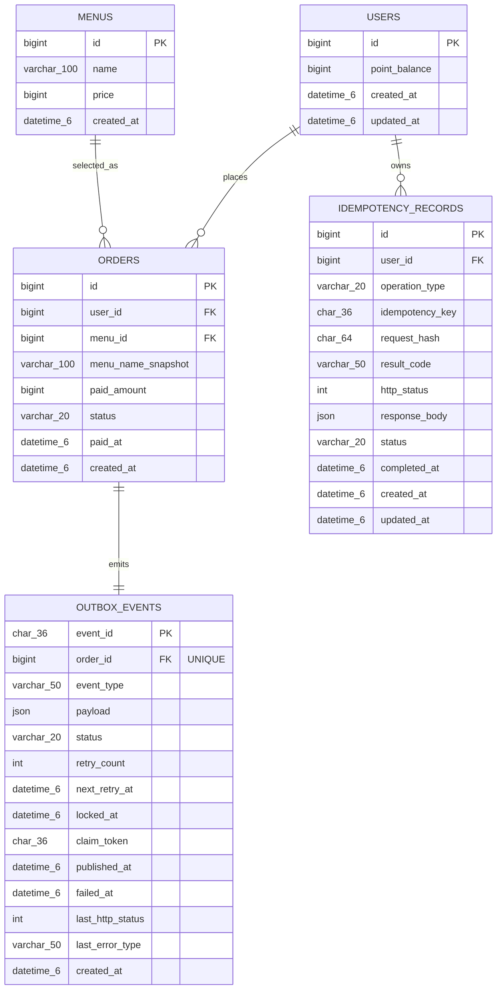
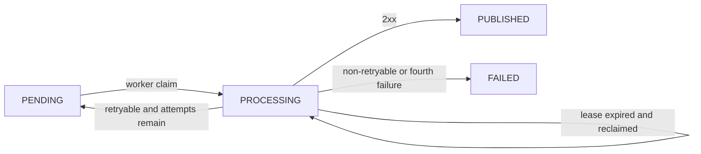

# ERD

## 1. 문서 상태와 해석 기준

이 문서는 사용자가 선택한 요구사항을 데이터 구조로 구체화한 **논리 모델 정본**이다. ADR별 승인 여부는 [ADR 목록](./adr/)에서 관리한다. 아래 테이블·제약·기준 데이터는 Flyway로 구현됐으며 업무 API와 트랜잭션도 이 모델을 사용한다. 변경 시 Flyway 마이그레이션과 실제 MySQL 8.4 LTS 스키마를 이 문서와 대조한다.

- 금액과 포인트는 소수점 오차가 없는 정수로 표현하며 `1원 = 1P`다.
- 날짜·시간은 UTC로 저장하고 API 경계에서 ISO 8601로 표현한다.
- 메뉴명·주문 스냅샷처럼 자연어를 담는 문자열은 `utf8mb4`를 사용한다. 상태·유형·UUID·해시처럼 계약상 정확히 일치해야 하는 코드는 `ascii_bin`으로 대소문자를 구분한다.
- 업무 ID는 `BIGINT AUTO_INCREMENT`, 이벤트 ID와 claim token은 UUID 문자열 `CHAR(36)`, 시각은 UTC `DATETIME(6)`을 사용한다.
- Mermaid 도식의 `varchar_N`, `char_36`, `datetime_6` 표기는 각각 SQL의 `VARCHAR(N)`, `CHAR(36)`, `DATETIME(6)`을 뜻한다.
- 상태에 따라 존재하지 않는 값으로 명시한 컬럼은 `NULL`을 허용하고, 그 밖의 컬럼은 모두 `NOT NULL`이다. Outbox의 `next_retry_at`과 마지막 오류 필드는 아래 상태별 필드 행렬을 따른다.
- 도식의 `PK`, `FK`와 UNIQUE 주석만 확정된 키를 표시한다. 복합 UNIQUE와 CHECK는 아래 표에서 설명한다.
- Mermaid 구형 미리보기 호환을 위해 지원 편차가 있는 `UK` 키 표기를 사용하지 않고 `UNIQUE` 주석을 사용한다.

## 2. 관계도



## 3. 관계와 보장 수준

| 부모 → 자식 | 논리 카디널리티 | DB가 직접 보장하는 것 | 애플리케이션 트랜잭션이 보장하는 것 |
|---|---|---|---|
| `users` → `orders` | 사용자 1명당 주문 0개 이상 | 주문은 존재하는 사용자 ID를 참조 | 요청 본문의 기존 사용자 ID로 주문 생성 |
| `menus` → `orders` | 메뉴 1개당 주문 0개 이상 | 주문은 존재하는 메뉴 ID를 참조 | 주문 시점의 현재 이름·가격을 스냅샷으로 저장 |
| `users` → `idempotency_records` | 사용자·작업별 레코드 0개 이상 | 레코드는 존재하는 사용자 ID를 참조 | 충전·주문의 최초 확정 결과 저장·재사용 |
| `orders` → `outbox_events` | 주문 1개당 이벤트 정확히 1개 | `order_id` UNIQUE로 **최대 1개** 보장 | 주문·Outbox 동시 저장으로 **최소 1개**도 보장 |

모든 FK는 `ON DELETE RESTRICT`, `ON UPDATE RESTRICT`를 사용한다. 사용자·메뉴 삭제 API가 없고 업무 기록을 cascade로 지우지 않는다.

## 4. 테이블 정의

### 4.1 `users`

기존 사용자 식별자와 현재 사용할 수 있는 포인트 잔액을 보유한다. 사용자 생성·관리, 포인트 원장과 충전·사용 이력 테이블은 이번 범위에 두지 않는다.

| 컬럼 | 의미 | 논리 규칙 |
|---|---|---|
| `id` | 사용자 식별자 | PK, 주문·멱등 레코드의 참조 대상 |
| `point_balance` | 현재 포인트 잔액 | signed `BIGINT`, `NOT NULL DEFAULT 0`, `0` 이상 |
| `created_at` | 생성 시각 | UTC |
| `updated_at` | 사용자 정보 또는 잔액 변경 시각 | UTC |

충전과 주문은 `id`로 사용자 행을 `FOR UPDATE` 조회한다. 같은 사용자의 변경은 직렬화되고 서로 다른 사용자는 서로 다른 행을 잠근다. 애플리케이션 검증과 별도로 `CHECK (point_balance >= 0)`를 둔다. 임의의 업무 상한은 없으며 충전 서비스가 signed `BIGINT` 덧셈 overflow를 검사한다.

사용자 생성·관리 API는 현재 범위에 두지 않는다. Flyway는 과제·로컬 수동 검증용 기준 사용자 `id=1`, `point_balance=0`을 준비한다. 이 행은 사용자 생성 기능을 뜻하지 않으며 통합 테스트는 seed에 의존하지 않고 각 테스트가 사용할 사용자 행을 독립 fixture로 준비한다. 요청한 사용자가 없으면 멱등 레코드를 만들지 않고 `USER_NOT_FOUND`로 거절한다.

### 4.2 `menus`

Flyway로 배포하는 고정 메뉴 카탈로그다. 현재 범위에는 관리 CRUD나 판매 상태가 없다.

| 컬럼 | 의미 | 논리 규칙 |
|---|---|---|
| `id` | 메뉴 식별자 | PK, 인기 순위 동률 해소 기준 |
| `name` | 현재 메뉴명 | 메뉴 목록과 인기 메뉴 응답에 사용 |
| `price` | 현재 포인트 가격 | 정수, `0`보다 큼 |
| `created_at` | 생성 시각 | UTC |

`CHECK (price > 0)`를 둔다.

프로젝트 소유자가 과제용 기준 데이터로 확정한 초기 카탈로그는 Flyway로 다음 값을 삽입한다.

| ID | 이름 | 가격 |
|---:|---|---:|
| 1 | 아메리카노 | 4,000P |
| 2 | 카페라떼 | 5,000P |
| 3 | 카푸치노 | 5,500P |

메뉴명은 `VARCHAR(100)`이며 UNIQUE로 강제하지 않는다. 메뉴 삭제는 허용하지 않고 이름·가격 변경은 Flyway 마이그레이션으로 수행한다.

### 4.3 `orders`

메뉴 하나의 결제 완료 주문을 불변 기록으로 보존한다. 이번 범위에서 주문은 생성 시 이미 결제 완료이며 부분 결제·취소·환불 상태를 표현하지 않는다.

| 컬럼 | 의미 | 논리 규칙 |
|---|---|---|
| `id` | 주문 식별자 | PK |
| `user_id` | 주문한 사용자 | `users.id` FK |
| `menu_id` | 주문한 메뉴 | `menus.id` FK, 인기 메뉴 집계 키 |
| `menu_name_snapshot` | 주문 당시 메뉴명 | 생성 후 변경하지 않음 |
| `paid_amount` | 주문 당시 실제 차감 포인트 | 정수, `0`보다 큼, 생성 후 변경하지 않음 |
| `status` | 주문 상태 | 현재 허용 값은 `PAID` |
| `paid_at` | 결제 확정 시각 | UTC, 인기 메뉴 시간 경계 |
| `created_at` | 레코드 생성 시각 | UTC |

메뉴 하나, 수량 1이 현재 주문 모델이므로 수량과 `order_items`를 저장하지 않는다. 인기 메뉴 주문 횟수는 `orders`에서 집계하고 응답 이름·가격은 현재 `menus`에서 가져온다. `CHECK (paid_amount > 0)`를 둔다. 상태는 `VARCHAR(20)`과 `CHECK (status IN ('PAID'))`로 강제한다.

### 4.4 `idempotency_records`

충전과 주문의 최초 확정 결과를 저장한다. 업무 변경과 같은 DB 트랜잭션에 참여하며 멱등 레코드만 별도 선행 트랜잭션으로 확정하지 않는다.

| 컬럼 | 의미 | 상태별 규칙 |
|---|---|---|
| `id` | 내부 식별자 | PK |
| `user_id` | 요청 사용자 | `users.id` FK |
| `operation_type` | 충전·주문 구분 | 같은 키를 작업 종류별로 분리 |
| `idempotency_key` | 클라이언트의 논리 요청 UUID | `CHAR(36)`, 사용자·작업과 함께 UNIQUE |
| `request_hash` | 작업 유형과 검증된 업무 값의 SHA-256 | 16진수 `CHAR(64)`, 같은 키의 요청 동일성 비교 |
| `result_code` | 최초 확정 응답 코드 | `COMPLETED` 결과의 일부 |
| `http_status` | 최초 HTTP 상태 | `COMPLETED` 결과의 일부 |
| `response_body` | 최초 응답 본문 | `COMPLETED` 결과 재사용 |
| `status` | 처리 상태 | `PROCESSING`, `COMPLETED` |
| `completed_at` | 결과 확정 시각 | `COMPLETED`의 최소 24시간 보존 기준 |
| `created_at` | 선점 시작 시각 | UTC |
| `updated_at` | 마지막 상태 변경 시각 | UTC, 현재 모델에서 완료 시각 후보 |

UNIQUE `(user_id, operation_type, idempotency_key)`가 동시 최초 요청을 하나로 수렴시킨다. 해시가 같으면 완료 결과를 재사용하고 다르면 `409 IDEMPOTENCY_KEY_REUSED`로 거절한다. 성공과 예상 가능한 비즈니스 실패는 결과를 저장하고 커밋하며, 인프라 오류는 업무 변경과 레코드를 모두 롤백한다.

`COMPLETED` 레코드는 `completed_at`부터 최소 24시간 보존하고 이후 삭제할 수 있다. 자동 정리 시각과 자동 스케줄러는 현재 계약에 없으며 실제로 삭제된 키만 새 요청으로 처리될 수 있다. `PROCESSING`에서는 결과 컬럼과 `completed_at`이 `NULL`, `COMPLETED`에서는 모두 `NOT NULL`이어야 한다.

위 상태별 결과 컬럼 조합은 애플리케이션 검증뿐 아니라 MySQL CHECK로 강제한다.

### 4.5 `outbox_events`

결제 완료 주문을 외부 데이터 수집 API로 전달하기 위한 이벤트와 워커 처리 상태를 보관한다.

| 컬럼 | 의미 | 상태별 규칙 |
|---|---|---|
| `event_id` | 외부에도 전달하는 이벤트 식별자 | PK, 수신 측 중복 제거 키 |
| `order_id` | 이벤트의 원인 주문 | `orders.id` FK, UNIQUE |
| `event_type` | 이벤트 종류 | 현재 값은 `ORDER_PAID` |
| `payload` | 외부 전송 데이터 | 주문과 같은 트랜잭션에서 확정 |
| `status` | 전달 상태 | `PENDING`, `PROCESSING`, `PUBLISHED`, `FAILED` |
| `retry_count` | 현재 claim으로 결과 반영에 성공한 실패 시도 횟수 | 반영된 실패마다 1 증가, 최초 `0`, 최댓값 `4` |
| `next_retry_at` | 다음 전송 가능 시각 | `PENDING`·`PROCESSING`에서 필수, 최종 상태에서 `NULL` |
| `locked_at` | 현재 claim 시작 시각 | `PROCESSING`의 30초 lease 판정 |
| `claim_token` | 현재 점유 소유권 토큰 | 결과 갱신 fencing |
| `published_at` | 발행 성공 시각 | `PUBLISHED` 30일 보존 기준 |
| `failed_at` | 최종 실패 시각 | `FAILED`에서만 값 존재 |
| `last_http_status` | 마지막 HTTP 상태 | HTTP 실패 응답이 있을 때만 존재, 네트워크·timeout과 최종 성공이면 `NULL` |
| `last_error_type` | 마지막 실패 분류 | 재시도 중 또는 `FAILED`에서 `TIMEOUT`, `NETWORK`, `HTTP_3XX`, `HTTP_4XX`, `HTTP_5XX`; 최종 성공이면 `NULL` |
| `created_at` | 이벤트 생성 시각 | UTC, 주문 트랜잭션에서 기록 |

`order_id` UNIQUE는 주문 하나에 `ORDER_PAID` 이벤트 하나만 생성하는 모델을 반영한다. `claim_token`은 점유할 때마다 새 값으로 교체하고, 결과 갱신은 `event_id`, `PROCESSING`, `claim_token`이 모두 일치할 때만 허용한다.

`event_id`와 `claim_token`은 UUID `CHAR(36)`이다. 완료 뒤 `locked_at`과 `claim_token`은 `NULL`로 정리한다. `PUBLISHED`에서는 `published_at`만 완료 시각으로 남기고 `next_retry_at`과 마지막 오류 정보를 `NULL`로 정리한다. `FAILED`에서는 `failed_at`과 `last_error_type`이 `NOT NULL`이고 `next_retry_at`은 `NULL`이다. 응답 본문과 stack trace는 저장하지 않는다.

상태별 필드 조합은 다음과 같다.

| 상태 | `retry_count` | `next_retry_at` | claim 정보 | 마지막 오류 정보 | 완료 시각 |
|---|---:|---|---|---|---|
| 최초 `PENDING` | `0` | 필수 | `NULL` | `NULL` | 모두 `NULL` |
| 재시도 `PENDING` | `1`~`3` | 필수 | `NULL` | `last_error_type` 필수, HTTP 응답이 있을 때만 `last_http_status` 존재 | 모두 `NULL` |
| `PROCESSING` | `0`~`3` | 필수 | `locked_at`, `claim_token` 필수 | `0`이면 `NULL`, `1`~`3`이면 직전 실패 정보 보존 | 모두 `NULL` |
| `PUBLISHED` | `0`~`3` | `NULL` | `NULL` | `NULL` | `published_at`만 필수 |
| `FAILED` | `1`~`4` | `NULL` | `NULL` | `last_error_type` 필수, HTTP 응답이 있을 때만 `last_http_status` 존재 | `failed_at`만 필수 |

이 조합을 MySQL CHECK로 강제한다. 현재 claim으로 결과 반영에 성공한 실패는 영구 `3xx`·`4xx`를 포함해 `retry_count`를 1 증가시키고 fencing으로 거절된 이전 claim 결과는 세지 않는다. 성공 전 마지막 실패 상세는 `PUBLISHED` 전환 시 정리한다.

## 5. 목표 제약 조건

| 테이블 | 컬럼·식 | 종류 | 보장 |
|---|---|---|---|
| `users` | `id` | PK | 사용자 식별 |
| `users` | `point_balance >= 0` | CHECK | 음수 잔액 방지 |
| `menus` | `id` | PK | 메뉴 식별 |
| `menus` | `price > 0` | CHECK | 0·음수 가격 방지 |
| `orders` | `id` | PK | 주문 식별 |
| `orders` | `user_id`, `menu_id` | FK | 존재하는 사용자·메뉴 참조 |
| `orders` | `paid_amount > 0` | CHECK | 잘못된 결제금액 방지 |
| `orders` | `status IN ('PAID')` | CHECK | 현재 주문 상태 제한 |
| `idempotency_records` | `id` | PK | 내부 식별 |
| `idempotency_records` | `user_id` | FK | 존재하는 사용자 참조 |
| `idempotency_records` | `(user_id, operation_type, idempotency_key)` | UNIQUE | 논리 요청 중복 방지 |
| `idempotency_records` | `operation_type IN ('CHARGE', 'ORDER')` | CHECK | 작업 유형 제한 |
| `idempotency_records` | `status IN ('PROCESSING', 'COMPLETED')` | CHECK | 멱등 상태 제한 |
| `idempotency_records` | 상태별 결과 필드·`completed_at` NULL 조합 | CHECK | 진행 중 결과 부재와 완료 결과 존재 보장 |
| `outbox_events` | `event_id` | PK | 이벤트 식별·중복 제거 키 |
| `outbox_events` | `order_id` | FK, UNIQUE | 존재하는 주문당 이벤트 최대 1개 |
| `outbox_events` | `event_type = 'ORDER_PAID'` | CHECK | 이벤트 유형 제한 |
| `outbox_events` | `retry_count BETWEEN 0 AND 4`와 상태별 세부 범위 | CHECK | 반영된 실패 시도 횟수와 상태 조합 보장 |
| `outbox_events` | `status IN ('PENDING', 'PROCESSING', 'PUBLISHED', 'FAILED')` | CHECK | 전달 상태 제한 |
| `outbox_events` | 상태별 `next_retry_at`·claim·마지막 오류·완료 시각 NULL 조합 | CHECK | 재시도·점유·완료 상태의 모순 방지 |

UNIQUE와 CHECK는 애플리케이션 검증의 대체물이 아니라 마지막 방어선이다. 제약 위반은 도메인 오류와 경쟁 조건을 구분해 일관된 API 오류로 변환해야 한다.

## 6. 인덱스와 핵심 경로

| 테이블 | 키 순서 | 유일성 | 지원 경로 | 검증 포인트 |
|---|---|---:|---|---|
| `users` | `(id)` | 예 | 사용자 PK 조회와 `FOR UPDATE` | 단건 접근, 락 대기 |
| `orders` | `(status, paid_at, menu_id)` | 아니요 | 7일 결제 주문 집계 | 스캔 행, 임시 테이블, 정렬 |
| `idempotency_records` | `(user_id, operation_type, idempotency_key)` | 예 | 선점·결과 조회·키 충돌 | 중복 삽입 대기 |
| `outbox_events` | `(event_id)` | 예 | claim 결과 fencing 갱신 | PK 단건 갱신 |
| `outbox_events` | `(order_id)` | 예 | 주문당 이벤트 중복 방지 | 중복 삽입 실패 |
| `outbox_events` | `(status, next_retry_at)` | 아니요 | 즉시·예약 전송 후보 | backlog, 후보 스캔 수 |

FK용 인덱스와 업무 인덱스의 중복은 실제 DDL에서 확인한다. 운영과 유사한 데이터 분포에서 `EXPLAIN ANALYZE`로 선택 인덱스, 실제 행 수, 임시 테이블과 정렬 여부를 기록한다.

`outbox_events(status, locked_at)`은 lease 만료 조회 성능을 측정한 뒤 검토할 인덱스 후보다. 정확성 계약이 아니라 실행 계획에 따른 물리 튜닝 항목이다.

## 7. 상태 전이

### 7.1 멱등 레코드

| 현재 상태 | 사건 | 다음 상태 | 트랜잭션 결과 |
|---|---|---|---|
| 없음 | 최초 충전·주문 시작 | `PROCESSING` | 업무 처리와 같은 미커밋 트랜잭션 |
| `PROCESSING` | 성공 | `COMPLETED` | 업무 변경과 최초 결과 함께 커밋 |
| `PROCESSING` | 예상 가능한 비즈니스 실패 | `COMPLETED` | 업무 변경 없이 실패 결과 커밋 |
| `PROCESSING` | 인프라 오류 | 없음 | 전체 롤백 |
| `COMPLETED` | 같은 해시 재요청 | `COMPLETED` | 기존 결과 반환, 추가 변경 없음 |
| `COMPLETED` | 다른 해시 재요청 | `COMPLETED` | `409`, 추가 변경 없음 |

`PROCESSING`은 트랜잭션 내부 진행 상태다. 단일 트랜잭션 정책상 커밋 뒤 장시간 남는 상태를 전제로 별도 lease를 추가하지 않는다.

### 7.2 Outbox 이벤트



| 실패한 시도 | `retry_count` | 다음 동작 |
|---:|---:|---|
| 첫 시도 | 1 | 1분 뒤 `PENDING` |
| 둘째 시도 | 2 | 5분 뒤 `PENDING` |
| 셋째 시도 | 3 | 30분 뒤 `PENDING` |
| 넷째 시도 | 4 | `FAILED` |

HTTP `2xx`는 `PUBLISHED`다. 네트워크 오류·timeout·`408`·`429`·`5xx`는 남은 시도가 있으면 재시도한다. redirect는 따르지 않으며 `3xx`와 그 밖의 `4xx`는 해당 실패의 `retry_count`를 증가시킨 뒤 즉시 `FAILED`다.

## 8. Outbox 점유와 fencing

다음 SQL은 물리 DDL이 아니라 트랜잭션 의도를 보여주는 개념 예시다. 워커는 활성 배치가 없을 때 기본 1초마다 실행하고 최대 50건을 선점한다. 워커 정상·전송 가능한 기존 backlog 없음 조건에서는 주문 커밋 후 2초 이내에 최초 외부 HTTP 요청을 시작한다.

```sql
SELECT event_id
FROM outbox_events
WHERE (status = 'PENDING' AND next_retry_at <= :now)
   OR (status = 'PROCESSING' AND locked_at <= :lease_cutoff)
ORDER BY next_retry_at, created_at, event_id
LIMIT :batch_size
FOR UPDATE SKIP LOCKED;
```

같은 짧은 트랜잭션에서 선택 행을 `PROCESSING`으로 바꾸고 새 `claim_token`, `locked_at`을 기록한다. 커밋 뒤 JDK 비동기 HTTP 클라이언트로 배치를 병렬 전송하고 각 결과는 별도의 짧은 트랜잭션에서 다음 조건으로 갱신한다.

```sql
UPDATE outbox_events
SET status = :next_status,
    retry_count = :retry_count,
    next_retry_at = :next_retry_at,
    published_at = :published_at,
    failed_at = :failed_at,
    last_http_status = :last_http_status,
    last_error_type = :last_error_type,
    locked_at = NULL,
    claim_token = NULL
WHERE event_id = :event_id
  AND status = 'PROCESSING'
  AND claim_token = :claim_token;
```

영향받은 행이 0개면 다른 워커가 재점유한 것이므로 이전 결과를 버린다. fencing은 DB 상태 덮어쓰기는 막지만 외부 API 중복 호출은 막지 못하므로 수신 측은 `event_id`로 중복을 제거한다. 연결 timeout은 2초, 요청 전체 timeout은 5초, lease는 30초다.

## 9. 트랜잭션 불변식

1. `users.point_balance`는 어떤 커밋 상태에서도 음수가 아니다.
2. 같은 사용자의 충전과 주문은 사용자 PK 비관적 락으로 직렬화된다.
3. 같은 사용자·작업의 동일 멱등키는 하나만 존재한다.
4. 충전의 잔액 변경과 멱등 결과는 함께 커밋하거나 함께 롤백한다.
5. 주문의 포인트 차감, 주문, Outbox, 멱등 결과는 함께 커밋하거나 함께 롤백한다.
6. 커밋된 주문에는 대응하는 Outbox 이벤트가 정확히 하나 존재한다.
7. 주문의 `menu_name_snapshot`과 `paid_amount`는 생성 후 변경하지 않는다.
8. 외부 HTTP 호출은 고객 요청 DB 트랜잭션 안에서 실행하지 않는다.
9. Outbox 결과는 현재 `claim_token` 소유자만 갱신한다.

`orders`와 `outbox_events`의 정확히 하나 관계는 FK·UNIQUE만으로 전부 강제되지 않는다. 주문 서비스의 동시 저장과 실제 MySQL 통합 테스트로 이벤트 없는 주문을 방지한다.

## 10. 인기 메뉴 데이터 경로

```text
orders(PAID, [from, to))
  → menu_id별 COUNT
  → order_count 내림차순, menu_id 오름차순
  → 상위 3개
  → menus에서 현재 name·price 조합
```

주문 수의 단일 진실 원천은 `orders`이며 응답 이름·가격은 현재 `menus` 값이다. 주문 스냅샷은 인기 메뉴 표시 정보로 사용하지 않는다. 시간 구간은 `[조회 시각 - 7일, 조회 시각)`이고 `(status, paid_at, menu_id)`의 실행 계획과 실제 스캔 행 수를 관찰한다.

메뉴는 삭제하지 않고 이름·가격 변경만 Flyway 마이그레이션으로 수행한다. 향후 삭제 요구가 생기면 과거 주문 집계와 현재 표시 정보의 조합 규칙을 새로 결정해야 한다.

## 11. 데이터 수명

| 데이터 | 보존 정책 | 기준 | 비고 |
|---|---|---|---|
| `idempotency_records.COMPLETED` | 최소 24시간 | `completed_at` | 이후 삭제 가능, 자동 스케줄러 없음 |
| `outbox_events.PUBLISHED` | 최소 30일 | `published_at` | 이후 삭제 가능, 자동 스케줄러 없음 |
| `outbox_events.FAILED` | 무기한 | 자동 삭제 없음 | 수동 재시도 API 없음 |
| `users`, `orders` | 무기한 | 자동 삭제 없음 | 회원 탈퇴·익명화 기능 없음 |
| `menus` | 삭제하지 않음 | Flyway 변경 | 이름·가격만 migration으로 변경 |

정리는 작은 배치로 실행해 고객 트랜잭션과 워커 점유를 오래 막지 않아야 한다. 구체적인 스케줄·크기·정리용 인덱스는 데이터 규모를 합의한 뒤 정한다.

## 12. 관측과 성능 검증

정상·backlog 없음 조건의 Outbox 최초 HTTP 요청 2초 기준 외 정량 성능 목표는 아직 미정이다.

| 경로 | DB 관측 | 애플리케이션 관측 |
|---|---|---|
| 포인트 잠금 | 행 락 대기, deadlock, 트랜잭션 시간 | 동일 사용자 경합률, p50/p95/p99 |
| 멱등 선점 | UNIQUE 충돌·대기, 단건 실행 계획 | 최초·재사용·키 충돌 비율 |
| 인기 메뉴 | `EXPLAIN ANALYZE`, 스캔 행, 임시 테이블·정렬 | 7일 주문 수, p50/p95/p99 |
| Outbox 점유 | 후보 쿼리 시간, 스캔 행 | 상태별 건수, oldest pending age |
| lease 복구 | 만료 후보, claim 갱신 0건 | 재점유·중복 전송·fencing 거부 |
| 데이터 정리 | 삭제 행, 잠금 시간, undo 증가 | 배치 시간과 실패 수 |

테스트는 대체 DB가 아니라 Docker Compose의 실제 MySQL을 사용해 `SKIP LOCKED`, CHECK, UNIQUE, 비관적 락과 실행 계획을 검증한다. 작은 테스트 데이터만으로 실행 계획을 판단하지 않고 주문 수와 Outbox backlog를 늘려 측정한다.

## 13. 의도적으로 단순화한 모델

- 단일 메뉴·수량 1 주문이므로 `order_items`를 만들지 않는다.
- 현재 잔액만 필요하므로 포인트 원장을 만들지 않는다.
- 메뉴는 Flyway 초기 데이터로 관리하고 관리자·판매 상태 모델을 두지 않는다.
- Outbox는 MySQL에서 처리하며 Kafka를 두지 않는다.
- 인기 메뉴는 주문에서 직접 집계하고 캐시·사전 집계 테이블을 두지 않는다.

다품목, 감사·환불, 메뉴 운영, 메시지 브로커, 사전 집계 요구가 생기면 기존 모델에 조용히 끼워 넣지 않고 새 결정으로 검토한다.

## 14. 구현 후 측정할 물리 튜닝 항목

- `outbox_events(status, locked_at)` 인덱스의 실제 필요성
- 인기 메뉴와 Outbox 쿼리의 실행 계획·스캔 행 수
- 보존 기간 경과 데이터를 실제로 삭제할 운영 절차와 배치 크기

확정된 컬럼·제약·타입을 바꾸거나 새 데이터 모델이 필요하면 사용자 선택을 받은 뒤 ADR에 남긴다.

## 15. 관련 ADR

- [ADR-0001: 포인트 변경에 DB 비관적 락 사용](./adr/0001-use-database-pessimistic-locking-for-points.md)
- [ADR-0015: 충전과 주문에 멱등키 적용](./adr/0015-protect-mutations-with-idempotency-keys.md)
- [ADR-0003: 주문 이벤트를 Transactional Outbox로 전달](./adr/0003-deliver-order-events-with-transactional-outbox.md)
- [ADR-0004: 인기 메뉴를 결제 완료 주문에서 직접 집계](./adr/0004-calculate-popular-menus-from-paid-orders.md)
- [ADR-0005: Java·Spring·MySQL 플랫폼 기준선](./adr/0005-establish-java-spring-mysql-platform-baseline.md)
- [ADR-0006: 기능 중심 모듈러 모놀리스](./adr/0006-use-feature-oriented-modular-monolith.md)
- [ADR-0016: 임의 상한 없이 현재 포인트 잔액 저장](./adr/0016-store-positive-point-balance-without-arbitrary-cap.md)
- [ADR-0022: 인증 없이 요청 본문의 사용자 ID 사용](./adr/0022-accept-user-id-without-authentication.md)
- [ADR-0009: 단일 메뉴 주문과 주문 시점 스냅샷](./adr/0009-model-single-menu-orders-with-snapshots.md)
- [ADR-0010: Docker Compose의 MySQL로 테스트](./adr/0010-test-against-mysql-with-docker-compose.md)
- [ADR-0011: DB 경합 timeout과 deadlock에 일시적 오류 반환](./adr/0011-return-temporary-unavailable-on-database-contention.md)
- [ADR-0013: 관측성에 Actuator와 Micrometer 사용](./adr/0013-use-actuator-and-micrometer-for-observability.md)
- [ADR-0014: Outbox 배치를 비동기로 병렬 전송](./adr/0014-send-outbox-batches-asynchronously.md)
- [ADR-0017: Outbox 최초 전송 시도 시간을 제한](./adr/0017-bound-first-outbox-attempt-latency.md)
- [ADR-0020: 상태 수명주기 불변식을 DB CHECK로 강제](./adr/0020-enforce-lifecycle-invariants-with-database-checks.md)
- [ADR-0023: Outbox 상태별 필드 수명주기 확정](./adr/0023-define-outbox-field-lifecycle.md)
- [ADR-0024: 과제와 로컬 실행용 기준 사용자 seed](./adr/0024-seed-reference-user-for-local-execution.md)
